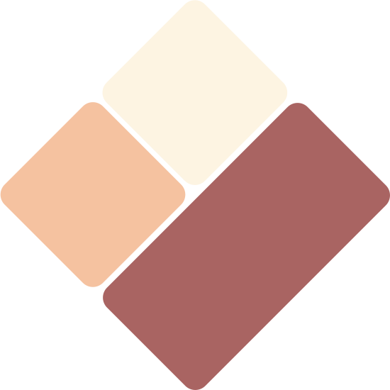

<br>

<h1 align="center">
  ✨ StyoCSS ✨
</h1>

<h3 align="center">
  The instant on-demand Atomic CSS-in-JS engine
</h4>

<br>
<br>

<p align="center">
  
</p>

<br>
<br>

<p align="center">
  <code>Atomic CSS</code> + <code>CSS-in-JS</code> = <code>StyoCSS</code>
</p>

<br>

<blockquote align="center" font-size="10px">
  🚧 This project is still under development. 🚧
  
  The API is not stable yet.
</blockquote>

<br>

<p align="center">
  <a href="https://www.npmjs.com/package/@styocss/core">
    
  </a>
  <a href="https://www.npmjs.com/package/@styocss/core">
    
  </a>
  <a href="https://img.shields.io/bundlephobia/minzip/@styocss/core?style=flat-square">
    
  </a>
  <a href="https://img.shields.io/github/actions/workflow/status/DevilTea/styocss/ci.yml?style=flat-square">
    
  </a>

---

## Introduction

### What is StyoCSS?
> StyoCSS is an Atomic CSS-in-JS engine that allow you to write style in CSS-in-JS way and output in Atomic CSS way.
>
> Inspired by [UnoCSS](https://github.com/unocss/unocss), [WindiCSS](https://github.com/windicss/windicss), [TailwindCSS](https://github.com/tailwindlabs/tailwindcss), [StylifyCSS](https://github.com/stylify) and [Fela.js](https://github.com/robinweser/fela)!

### Why StyoCSS is been created?
<details>
  <summary>Click to 👀 the reason</summary>

> I love the idea of Atomic CSS, there are many great Atomic CSS solutions out there, such as UnoCSS, WindiCSS, TailwindCSS, Stylify, etc.
> 
> Unfortunately, I am poor to memorize the utility class names, so UnoCSS, WindiCSS or TailwindCSS is not for me.
>
> I am surprised by the zero learning curve concept of Stylify, but I don't like the idea of using a custom syntax to workaround the limitations of html class attribute.
>
> To solve the problems above, the CSS-in-JS way is the best way to write styles, but it is not the best way to output styles.
>
> So I created StyoCSS, it is a Atomic CSS-in-JS engine that allow you to write style in CSS-in-JS way and output in Atomic CSS way!
</details>

---

## Features
- 🥰 Framework Agnostic
  > It is decoupled from any framework, so you can use it with any framework!
- ✨ Zero Configuration
  > Basically, you don't need to configure anything!
- 📖 Zero Learning Curve
  > In the simplest case, you just need to know the css property names!
- ⚒️ Fully Customizable
  > Create your preset to fit your needs!
- 🧰 Macro Rules
  > Build your own rules by atomic rules or even other macro rules!
- 🧠 Typescript Intellisense 
  > Without any additional extension, you would get the intellisense support!
- 📦 Tiny Size (~3kb min+brotli)
  > The core is just that tiny and it has no runtime dependencies!

---

## Getting Started
### Using with Vite

#### Install the plugin:
```bash
npm i -D @styocss/vite-plugin-styocss
```

#### Add the plugin to your `vite.config.ts`:
```ts
// vite.config.ts
import { defineConfig } from 'vite'
import StyoCSS from '@styocss/vite-plugin-styocss'

export default defineConfig({
  plugins: [
    StyoCSS({ /* options */ }),
  ],
})
```

<details>
  <summary>Click to see the options</summary>

```ts
interface StyoPluginOptions {
  /**
   * List of file extensions to be processed by the plugin.
   * @default ['.vue', '.ts', '.tsx', '.js', '.jsx']
   */
  extensions?: string[]

  /**
   * Function to create a Styo instance. If not provided, a default instance will be created.
   * The function would provide a builder instance to customize the Styo instance.
   */
  createStyo?: (builder: StyoInstanceBuilder) => StyoInstance

  /**
   * Customize the name of the style function.
   * @default 'style'
   */
  nameOfStyleFn?: string

  /**
   * Enable/disable the generation of d.ts file, feel free to add it to your .gitignore.
   * If a string is provided, it will be used as the path to the d.ts file.
   * Default path is `<root of vite config>/styocss.d.ts`.
   * @default false
   */
  dts?: boolean | string
}
```

Creating a StyoInstance by the `createStyo` option:
```ts
StyoCSS({
  createStyo: (builder) => {
    // Customize the Styo instance here
    return builder
      // Set the prefix of the generated atomic rule names
      .setPrefix('styo-')
      // Set the default value of the `$nestedWith` property
      .setDefaultNestedWith('@media (min-width: 1000px)')
      // Set the default value of the `$selector` property
      .setDefaultSelector('.default .{a}')
      // Set the default value of the `$important` property
      .setDefaultImportant(true)
      // Use a preset
      .usePreset('my-preset')
      // Register `$nestedWith` value templates
      .registerNestedWithTemplates([
        '@media (min-width: 640px)',
        '@media (min-width: 768px)',
        '@media (min-width: 1024px)',
      ])
      // Register `$selector` value templates
      .registerSelectorTemplates([
        '&:hover',
        '&:focus',
        '&:active',
        '&:disabled',
      ])
      // Register a simple static macro styo rule
      .registerMacroStyoRule('center', [
        {
          display: 'flex',
          justifyContent: 'center',
          alignItems: 'center',
        },
      ])
      // When registering a macro styo rule, you may want to extend other macro styo rules.
      // There are two strategies:
      //   - Extending strategy 1:
      //     Using "__apply" key, which is able to override
      //     Aware that "__apply" would flatten the macro styo rules,
      //     so it's not recommended to use it with a macro styo rule
      //     which has multiple partials
      .registerMacroStyoRule('btn', [
        {
          $apply: ['center'],
          display: 'inline-flex',
          padding: '0.5rem 1rem',
          borderRadius: '0.25rem',
          cursor: 'pointer',
        },
      ])
      //   - Extending strategy 2:
      //     Directly using macro styo rule name,
      //     which is just like "append" and not able to override
      .registerMacroStyoRule('btn-primary', [
        'btn',
        {
          backgroundColor: 'blue',
        },
      ])
      // Register a simple dynamic macro styo rule
      .registerMacroStyoRule('padding-x', /px-\[(.*)\]/, 'px-[value]', ([, value]) => [{ paddingLeft: value, paddingRight: value }])
      // Macro styo rules without any properties, which is useful for using with "$apply"
      // Cases like breakpoint, theme, pseudo class, pseudo element, etc.
      .registerMacroStyoRule('@xsOnly', [{ $nestedWith: '@media (max-width: 639px)' }])
      .registerMacroStyoRule('[dark]', [{ $selector: '[theme="dark"] &' }])
      .registerMacroStyoRule(':hover', [{ $selector: '&:hover' }])
      .registerMacroStyoRule('::before', [{ $selector: '&::before' }])
      .done()
  },
})
```

</details>

#### Add the `virtual:styo.css` module to your `main.ts`:
```ts
// main.ts
import 'virtual:styo.css'
```

#### Use the `style` function to write styles:
> The `style` function is a global function that is provided by the plugin.
> You could customize the name of the function by the `nameOfStyleFn` option.

<details>
  <summary>Click to see more about the `style` function</summary>

- The arguments of the `style` function could be any number of `AtomicStyoRulesDefinition` objects or macro styo rules.
- The `style` function would return an array of atomic rule names.
- An `AtomicStyoRulesDefinition` object is an object that contains the atomic rules. For example:
  ```ts
  /* eslint 'quote-props': ['error', 'as-needed'] */
  const definition: AtomicStyoRulesDefinition = {
    // The following special properties are optional and they would be effect the current group of rules.
    //
    // A list of macro rules to apply to the atomic rules.
    $apply: ['btn', 'btn-primary'],
    // The nest selector of the rules. It's useful when you want to use media query or @supports .etc.
    $nestedWith: '@media (max-width: 640px)',
    // The selector of the rules. It's useful when you want to use pseudo-class or pseudo-element.
    // There are two special placeholders that you could use in the selector:
    // - `{a}`: The name of the atomic styo rule.
    //          It's useful when you want to combine with pseudo-class or pseudo-element.
    //          Even more, you could use it to construct an attribute selector!
    // - `&`: The placeholder for the inherited selector.
    //        It's useful when you want to combine with pseudo-class or pseudo-element,
    //        but you have already defined the default selector.
    $selector: '&:hover',
    // The important flag of the rules. It's useful when you want to override the default important flag.
    $important: true,
    // Rest of the properties would be treated as the css properties.
    // The property name in camelCase or kebab-case would both be accepted.
    backgroundColor: 'yellow',
    'background-color': 'yellow',
  }
  ```

</details>

```html
// App.vue
<template>
  <div 
    :class="style(
      // Easy to group styles by pseudo-class or media query.
      { 
        color: 'red',
        backgroundColor: 'yellow',
      },
      { 
        $selector: '.{a}:hover',
        color: 'blue',
        backgroundColor: 'green',
      },
      {
        $nestedWith: '@media (max-width: 640px)',
        fontSize: '32px',
      }
    )"
  >
    Hello World!
  </div>
</template>
```

```tsx
// App.tsx
export const App = () => {
  return (
    // The `style` function would return an array of atomic rule names.
    // You could use the `join` method to join the array into a string.
    <div className={style(/* ... */).join(' ')}>
      Hello World!
    </div>
  )
}
```

### Defining a preset
> Presets are useful when you want to share the customizations of your templates, macros, etc.

#### Install the `@styocss/core` package:
```bash
npm i @styocss/core
```

#### Define a preset:
```ts
// my-preset.ts
import { createStyoPreset } from '@styocss/core'

export const myPreset = createStyoPreset('my-preset')
  // Use a preset
  .usePreset('my-preset')
  // Register `$nestedWith` value templates
  .registerNestedWithTemplates([
    '@media (min-width: 640px)',
    '@media (min-width: 768px)',
    '@media (min-width: 1024px)',
  ])
  // Register `$selector` value templates
  .registerSelectorTemplates([
    '&:hover',
    '&:focus',
    '&:active',
    '&:disabled',
  ])
  // Register a simple static macro styo rule
  .registerMacroStyoRule('center', [
    {
      display: 'flex',
      justifyContent: 'center',
      alignItems: 'center',
    },
  ])
  // When registering a macro styo rule, you may want to extend other macro styo rules.
  // There are two strategies:
  //   - Extending strategy 1:
  //     Using "__apply" key, which is able to override
  //     Aware that "__apply" would flatten the macro styo rules,
  //     so it's not recommended to use it with a macro styo rule
  //     which has multiple partials
  .registerMacroStyoRule('btn', [
    {
      $apply: ['center'],
      display: 'inline-flex',
      padding: '0.5rem 1rem',
      borderRadius: '0.25rem',
      cursor: 'pointer',
    },
  ])
  //   - Extending strategy 2:
  //     Directly using macro styo rule name,
  //     which is just like "append" and not able to override
  .registerMacroStyoRule('btn-primary', [
    'btn',
    {
      backgroundColor: 'blue',
    },
  ])
  // Register a simple dynamic macro styo rule
  .registerMacroStyoRule('padding-x', /px-\[(.*)\]/, 'px-[value]', ([, value]) => [{ paddingLeft: value, paddingRight: value }])
  // Macro styo rules without any properties, which is useful for using with "$apply"
  // Cases like breakpoint, theme, pseudo class, pseudo element, etc.
  .registerMacroStyoRule('@xsOnly', [{ $nestedWith: '@media (max-width: 639px)' }])
  .registerMacroStyoRule('[dark]', [{ $selector: '[theme="dark"] &' }])
  .registerMacroStyoRule(':hover', [{ $selector: '&:hover' }])
  .registerMacroStyoRule('::before', [{ $selector: '&::before' }])
  .done()
```

---

## License
[MIT](./LICENSE)
