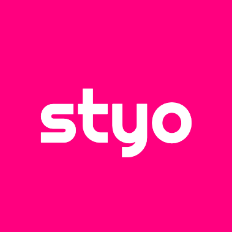

 

<h1 align="center">
  ✨ StyoCSS ✨
</h1>

<h3 align="center">
  The instant on-demand Atomic CSS-in-JS engine
</h3>

 
 

  

 
 

  <code>Atomic CSS</code> + <code>CSS-in-JS</code> = <code>StyoCSS</code>

 

<blockquote align="center" font-size="10px">
  🚧 This project is still under development. 🚧

  The API is not stable yet.
</blockquote>

  
  
  
  

---

## Introduction

### What is StyoCSS?
> StyoCSS is an Atomic CSS-in-JS engine that allow you to write style in CSS-in-JS way and output in Atomic CSS way.
>
> Inspired by [UnoCSS](https://github.com/unocss/unocss), [WindiCSS](https://github.com/windicss/windicss), [TailwindCSS](https://github.com/tailwindlabs/tailwindcss), [StylifyCSS](https://github.com/stylify) and [Fela.js](https://github.com/robinweser/fela)!

### Why StyoCSS is been created?

  
Click to 👀 the reason

> I love the idea of Atomic CSS, there are many great Atomic CSS solutions out there, such as UnoCSS, WindiCSS, TailwindCSS, Stylify, etc.
>
> Unfortunately, I am poor to memorize the utility class names, so UnoCSS, WindiCSS or TailwindCSS is not for me.
>
> I am surprised by the zero learning curve concept of Stylify, but I don't like the idea of using a custom syntax to workaround the limitations of html class attribute.
>
> To solve the problems above, the CSS-in-JS way is the best way to write styles, but it is not the best way to output styles.
>
> So I created StyoCSS, it is a Atomic CSS-in-JS engine that allow you to write style in CSS-in-JS way and output in Atomic CSS way!

---

## Features
- 🥰 Framework Agnostic
  > It is decoupled from any framework, so you can use it with any framework!
- 🛠 Zero Runtime
  > It transforms CSS-in-JS to Atomic CSS at build time!
- 📖 Zero Learning Curve
  > In the simplest case, you just need to know the css property names!
- 🤖 TypeScript Auto-Completion
  > It has built-in TypeScript support, so you can get auto-completion!

---

 
 

  Vite + Vue3 Example

  

 
 

---

## License
[MIT](./LICENSE)
