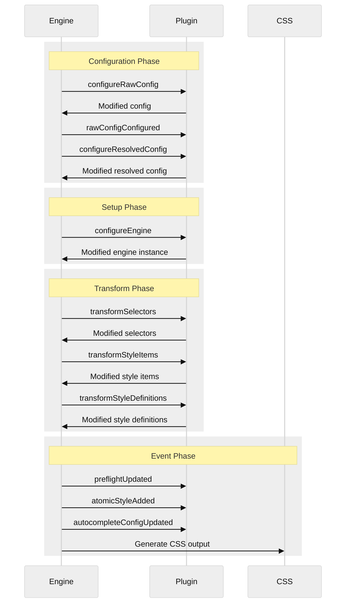
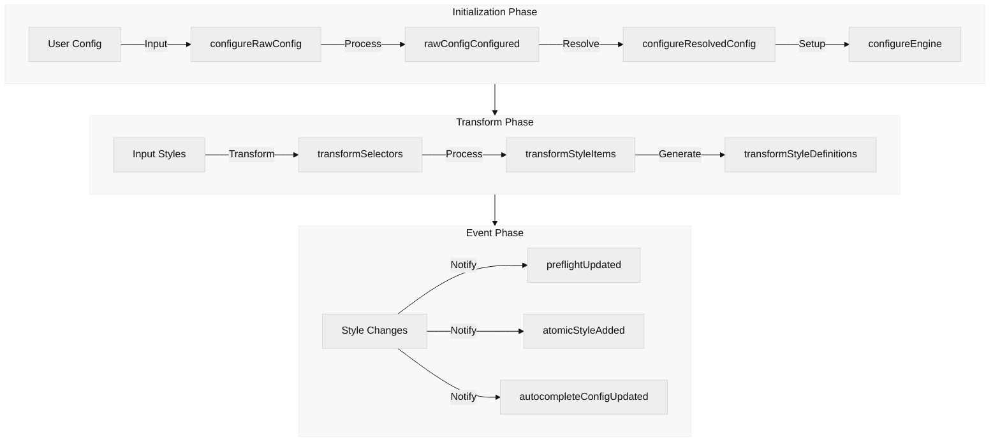
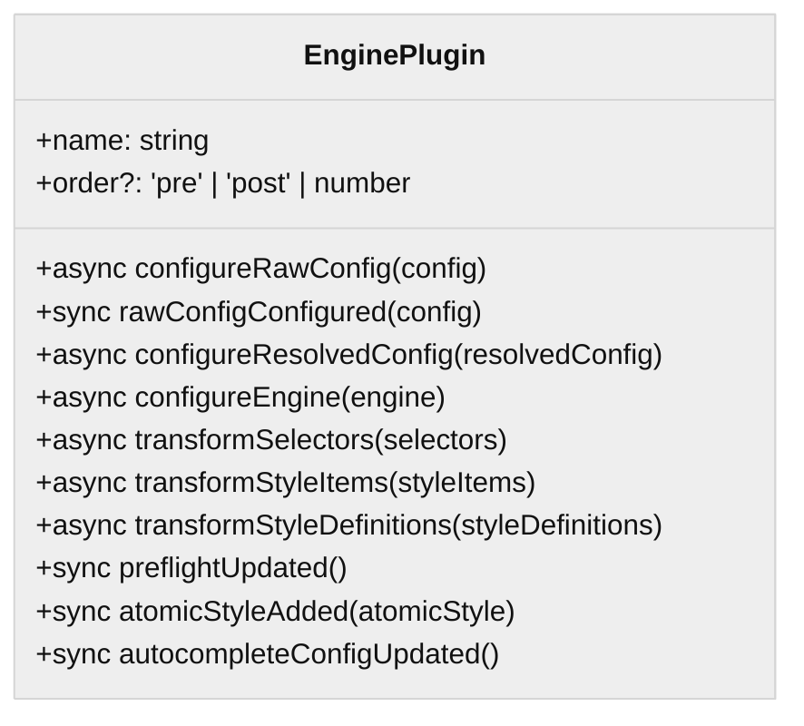

# Plugin System

PikaCSS provides a powerful plugin system that allows you to extend its functionality. This guide will help you understand how the plugin system works and how to create your own plugins.

## Overview

The PikaCSS plugin system is built around the concept of hooks that allow plugins to interact with different stages of the CSS generation process.

## Core Plugins

PikaCSS comes with several built-in core plugins that provide essential functionality:

- [`variables`](/guide/variables) - Manages CSS variables
- [`keyframes`](/guide/keyframes) - Processes @keyframes animations
- [`selectors`](/guide/selectors) - Handles custom selector transformations
- [`shortcuts`](/guide/shortcuts) - Manages style shortcuts
- [`important`](/guide/important) - Handles !important declarations

## Plugin Lifecycle



## Creating a Plugin

Here's the anatomy of a PikaCSS plugin:

```typescript
import { defineEnginePlugin, type EnginePlugin } from '@pikacss/core'

export function myPlugin(): EnginePlugin {
	return defineEnginePlugin({
		name: 'my-plugin',

		// Optional: Set plugin order
		order: 'pre', // 'pre' | 'post' | undefined

		// Hook: Configure raw config
		async configureRawConfig(config) {
			return {
				...config,
				// Add your modifications
			}
		},

		// Hook: Raw config configured
		rawConfigConfigured(config) {
			// React to config changes
		},

		// Hook: Configure resolved config
		async configureResolvedConfig(resolvedConfig) {
			return {
				...resolvedConfig,
				// Add your modifications
			}
		},

		// Hook: Configure engine instance
		async configureEngine(engine) {
			// Setup engine extras
			return engine
		},

		// Hook: Transform selectors
		async transformSelectors(selectors) {
			return selectors.map((selector) => {
				// Transform selectors
				return selector
			})
		},

		// Hook: Transform style items
		async transformStyleItems(styleItems) {
			return styleItems.map((item) => {
				// Transform style items
				return item
			})
		},

		// Hook: Transform style definitions
		async transformStyleDefinitions(styleDefinitions) {
			return styleDefinitions.map((def) => {
				// Transform style definitions
				return def
			})
		}
	})
}
```

## Plugin Hook Workflow



## Plugin Hook Types



### Sync Hooks
- `rawConfigConfigured` - Called after raw config is configured
- `preflightUpdated` - Called when preflight styles are updated
- `atomicStyleAdded` - Called when an atomic style is added
- `autocompleteConfigUpdated` - Called when autocomplete config is updated

### Async Hooks
- `configureRawConfig` - Configure raw engine config
- `configureResolvedConfig` - Configure resolved engine config
- `configureEngine` - Configure engine instance
- `transformSelectors` - Transform CSS selectors
- `transformStyleItems` - Transform style items
- `transformStyleDefinitions` - Transform style definitions

## Using Plugins

To use a plugin, add it to the `plugins` array in your PikaCSS configuration:

```typescript
import { defineEngineConfig } from '@pikacss/core'
import { icons } from '@pikacss/plugin-icons'
import { myPlugin } from './my-plugin'

export default defineEngineConfig({
	plugins: [
		icons(), // Add icon support
		myPlugin() // Add your custom plugin
	]
})
```

## Plugin Execution Order

Plugins are executed in the following order:

1. Plugins with `order: 'pre'`
2. Plugins with no order specified
3. Plugins with `order: 'post'`

This allows you to control when your plugin runs relative to other plugins.

## Best Practices

- Give your plugin a descriptive name that reflects its functionality
- Document your plugin's configuration options
- Follow the async/sync pattern for hooks as defined in the plugin interface
- Use TypeScript for better type safety and developer experience
- Handle errors gracefully and provide meaningful error messages
- Test your plugin with different configurations and edge cases

## Engine Instance Utility Methods

Plugins receive an engine instance in the `configureEngine` hook. Here are the utility methods provided by the Engine:

- `addPreflight(preflight: PreflightConfig)` - Add preflight styles
- `appendAutocompleteSelectors(...selectors)` - Add selectors available for autocompletion
- `appendAutocompleteStyleItemStrings(...styleItemStrings)` - Add style strings available for autocompletion
- `appendAutocompleteExtraProperties(...properties)` - Add extra properties available for autocompletion
- `appendAutocompleteExtraCssProperties(...properties)` - Add extra CSS properties available for autocompletion
- `appendAutocompletePropertyValues(property, ...tsTypes)` - Add available TypeScript types for a property
- `appendAutocompleteCssPropertyValues(property, ...values)` - Add available values for a CSS property
- `notifyPreflightUpdated()` - Notify subscribers when preflight styles are updated
- `notifyAtomicStyleAdded(atomicStyle)` - Notify subscribers when a new atomic style is added
- `notifyAutocompleteConfigUpdated()` - Notify subscribers when autocomplete configuration is updated

### Store Access

The engine instance also provides access to the following data:

```ts
store = {
	// Map of all generated atomic style IDs
	atomicStyleIds: Map</* style */ string, /* id */ string>,
	// Map of all generated atomic styles
	atomicStyles: Map</* id */ string, AtomicStyle>,
}
```

## Defining Custom Config and Extra Properties

Plugins can extend the engine's configuration and add extra properties. You can do this by augmenting the built-in interfaces:

```typescript
declare module '@pikacss/core' {
	interface EngineConfig {
		myPlugin?: {
			// Define your plugin's configuration options
			enabled?: boolean
			options?: {
				// Custom options
				mode?: 'light' | 'dark'
				prefix?: string
			}
		}
	}

	interface Engine {
		myPlugin: {
			// Define extra properties and methods
			store: Map<string, CustomData>
			add: (...items: CustomItem[]) => void
		}
	}
}
```

You can then access these in your plugin:

```typescript
export function myPlugin(): EnginePlugin {
	return defineEnginePlugin({
		name: 'my-plugin',

		// Access custom config in hooks
		configureRawConfig(config) {
			const options = config.myPlugin?.options
			// ...
		},

		// Set up extra properties
		configureEngine(engine) {
			engine.extra.myPlugin = {
				store: new Map(),
				add: (...items) => {
					items.forEach((item) => {
						// Process and store items
						engine.myPlugin.store.set(item.id, item)
					})
				}
			}
		}
	})
}
```

### Best Practices for Plugin Properties

1. **Config Interface**
   - Use descriptive names that reflect functionality
   - Document each option with JSDoc comments
   - Provide sensible defaults
   - Consider making config properties optional

2. **Extra Properties**
   - Follow the pattern of `store` + utility methods
   - Use TypeScript for better type safety
   - Add methods to manipulate stored data
   - Trigger appropriate notifications when data changes

3. **Type Augmentation**
   - Place interface augmentations in your plugin's main file
   - Export types that users might need
   - Follow existing core plugins' patterns for consistency
